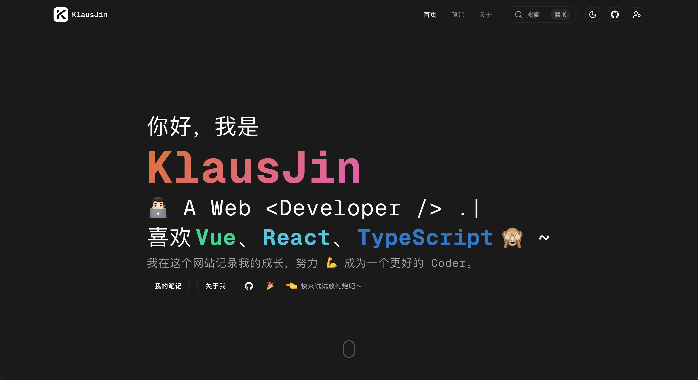

<div align="center">
  <h1>klausjin.com</h1>
  <a href="https://klausjin.com" target="_blank">
    
  </a>
</div>

<p align="center">
  <br>
  <strong>个人博客项目 | 学习技术、记录成长</strong><br>
  <strong>💡 如果你喜欢这个项目，欢迎点个 Star 🌟</strong><br>
  <strong>随时可能会有破坏性更新，不建议用于生产环境❗️</strong><br>
  <strong>欢迎交流与学习，期待你的反馈与建议 🙌</strong><br>
  <br>
</p>

---

## 🚀 技术栈


[](https://klausjin.com/)

- 项目基于 **`Next.js 15` + `React 19` + `TypeScript` + `Tailwind CSS v4` + `HeroUI`** 构建。
- 项目使用的是 `Tailwind CSS v4`，**不兼容低版本浏览器**，后续有空再换到 `v3` 版本

---

## ✨ 项目特性

- 🚀 **服务端渲染（`SSR`）**：基于 `Next.js 15`，支持现代前后端一体开发
- 📦 **类型安全开发**：使用 `TypeScript` 编写，提升开发效率与安全性
- 🧩 **组件化设计**：结合 `HeroUI` 与 `Tailwind CSS v4` 编写可复用组件
- 📁 **数据库支持**：集成 `Prisma`，简化数据库 `CRUD` 操作
- 🎨 **Markdown 编辑器**：使用 `Bytemd` 并自定义插件优化预览体验
- 🌗 **主题切换**：使用 `next-theme` 支持明暗模式
- 🔐 **权限登录**：集成 `NextAuth v5`，支持 `GitHub` 登录管理后台
- 📷 **图像处理**：
  - 上传后自动压缩为 `webp`（使用 `sharp`）
  - 上传至阿里云 `OSS`，提升加载速度
- 📱 **响应式设计**：适配多种设备与屏幕尺寸
- 🛠️ **后台管理功能**：支持标签、笔记管理等核心功能
- 🔎 **全局搜索功能**：
  - 支持 `Command/Ctrl + K` 和 `Esc` 快捷键快速唤起和关闭搜索框
  - 基于 `Algolia` 提供即时搜索结果，提升内容检索体验
  - 支持搜索关键字 `高亮显示`，提升用户的使用体验

---

## 📦 快速开始

### 1. 克隆项目

```bash
git clone https://github.com/KlausJins/klausjin.git
cd klausjin
```

### 2. 安装依赖（使用 pnpm）

```bash
pnpm install
```

### 3. 配置环境变量

复制 `.env.example` 文件并重命名为 `.env.local`，根据实际需求填写：

```bash
cp .env.example .env.local
```

此外，你还需要配置：

- 数据库连接（例如 `PostgreSQL`）
- `GitHub OAuth`（用于登录）
- 阿里云 `OSS` 相关参数
- `NextAuth secret` 和 `URL`

### 4. 启动开发服务器

```bash
pnpm dev
```

---

## 📬 反馈与建议

如有问题或建议，欢迎通过以下方式联系我：

- 提交 [Issue](https://github.com/KlausJins/klausjin/issues)

---

## 🙏 致谢

本项目在开发过程中参考了以下优秀项目的设计与实现（排名不分先后）：

- [HeroUI](https://www.heroui.com/)

- [付小晨](https://fuxiaochen.com/)

- [薇尔薇](https://vio.vin/)

- [小植同学](https://blog.xiaoztx.top/)

- [彬红茶日记](https://note.redcha.cn/)

- [LobeHub](https://lobehub.com/zh/blog)

---

## 📄 License

本项目使用 `MIT License` 开源。欢迎自由使用与贡献。
